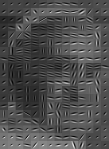
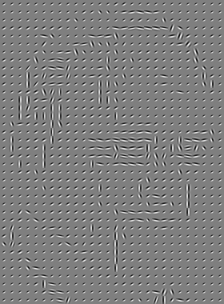

# Patchify filter

Inspired by the work of an artist I don't want to mention I created a filter
that create an image by splitting an image into tiles and replacing them from
the most similar from a database.

# How to use

Install python dependencies `pytorch`, `tqdm`, `numpy`, `PIL`, `sklearn` and
`matplotlib`. If you have a set of tiles that you want to use run the
`extract-features.py` to create the dictionary and then run
`compress-dictionary.py` to compress the dictionary. These two steps my take
over ten minutes. If you want to use the tiles that I use download the images
from and dictionary from [here](https://drive.google.com/drive/folders/1MqfiPWiIhMx6r8F0IhVPhZkj9vyZYKoJ?usp=sharing).
The tiles can also be generated using the `gabor-basis.py` script.

Then open the jupyter notebook `dictionary-matching.ipynb` and run all the
cells. You can experiment by changing the settings in there.

You can experiment using a different set of filters and modifing the way color
is used.

# How it works

It is easy to split an image into tiles the challenge is to match each patch to
a tile. To solve this problem I resort to doing vector search. This is finding
the closest vector in an database. But how do we transform a image patch into a
vector? and how do you find the closest vector?

A solution to the first question is to embed the image into a feature vector
using a convolutional neural network (CNN). A pre trained neural network that
learned to classify images uses a stack of filters to develop complex features.
This features represent things like color and shapes that describe an image.
This features are the vector that we will use for vector search.

The second question can be answered in a number of ways. I used the same
approach that is used in a novel Magnetic Resonance Imaging (MRI) called
Magnetic Resonance Fingerprinting (MRF). The idea is to embed the image into a
vector and find the vector from the database that gives the biggest dot product.
Doing the dot product with all the elements of the database can be
computationally expensive. To aviate this computational borden we can compress
the database using the singular value decomposition. In the following I describe
the math of this method, feel free to skip it if it is two complex for you.

First we generate a dictionary matrix $D$ by stacking each vector on the
database as rows. Finding the best match (according to the dot product) can be
done by matrix vector multiplication, $i = \arg\max | Dx |$. As mentioned above
this can be computationally expensive if the dictionary matrix is large.

The [singular value decomposition](https://en.wikipedia.org/wiki/Singular_value_decomposition)
(SVD) is a tool from linear algebra that factorizes a matrix $A$ into
$A=U\Sigma V^T$, with $U$ and $V$ a orthogonal matrices and $\Sigma$ a diagonal
matrix. The diagonal values of $\Sigma$, called singular values are in
descending order. By keeping only $k$ largest values on $\Sigma$ one get an
approximation of the matrix denoted $A_k = U\Sigma_k V^T$. The approximation
quality improves with the number singular values kept ($k$). We can compress the
dictionary by multiplying by the truncated $V_r$ matrix were only the first $k$
columns are kept, $D_k = DV_k^T$. Then we can find the best tile by first
projecting the target vector into the compressed space and find again the
largest dot product, $i = \arg\max | D_k V_k x |$.
